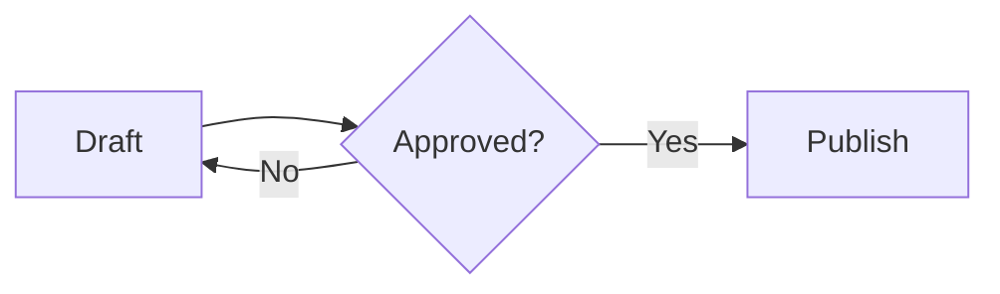

# Mermaid diagrams

Draw flowcharts, sequence diagrams, state diagrams, Gantt charts… from [Mermaid](https://mermaid.js.org/intro/) code right in a page. Diagrams are drawn in your browser; the content is never sent to an outside service.

## Add a diagram

1. Type `/` and pick **Mermaid diagram** (type `diagram` or `mermaid` to filter). The new block starts with a sample diagram.
2. Edit the code in the block: the diagram below redraws once you pause typing.
3. Leave the block with `Ctrl/⌘ + Enter`, or the down arrow on its last line.

You can also turn an existing block into a diagram with **Turn into › Mermaid diagram**. Markdown content with a ` ```mermaid ` block (e.g. a page an AI assistant wrote over MCP) shows as a diagram too.



## When reading a page

- Viewers (and you, when the page is read-only) see only the diagram; the code is hidden.
- Code with an error shows **Could not draw the diagram** with Mermaid's error line, and the code stays visible so it can be fixed.
- Diagrams follow the light/dark theme.

Search and AI assistants (MCP) read a diagram's code like any other code block.
