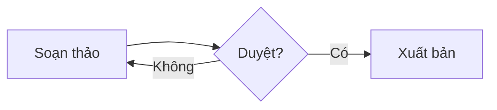

# Sơ đồ Mermaid

Vẽ lưu đồ, sơ đồ tuần tự, sơ đồ trạng thái, Gantt… bằng mã [Mermaid](https://mermaid.js.org/intro/) ngay trong trang. Sơ đồ được vẽ trên trình duyệt, không gửi nội dung ra dịch vụ bên ngoài.

## Thêm sơ đồ

1. Gõ `/` rồi chọn **Sơ đồ Mermaid** (gõ `so do` hoặc `mermaid` để lọc). Khối mới có sẵn một sơ đồ mẫu.
2. Sửa mã trong khối: sơ đồ bên dưới tự vẽ lại sau khi bạn ngừng gõ.
3. Thoát khối bằng `Ctrl/⌘ + Enter` hoặc mũi tên xuống ở dòng cuối.

Có thể biến một khối có sẵn thành sơ đồ qua **Chuyển thành › Sơ đồ Mermaid**. Nội dung Markdown có khối ` ```mermaid ` (vd trang do trợ lý AI tạo qua MCP) cũng hiện thành sơ đồ.



## Khi xem trang

- Người xem (và bạn khi trang ở chế độ chỉ đọc) chỉ thấy sơ đồ; mã được ẩn.
- Mã có lỗi: hiện thông báo **Không vẽ được sơ đồ** kèm dòng lỗi của Mermaid, mã vẫn hiện để sửa.
- Sơ đồ đổi màu theo giao diện sáng/tối.

Tìm kiếm và trợ lý AI (MCP) đọc được mã của sơ đồ như một khối mã thường.
